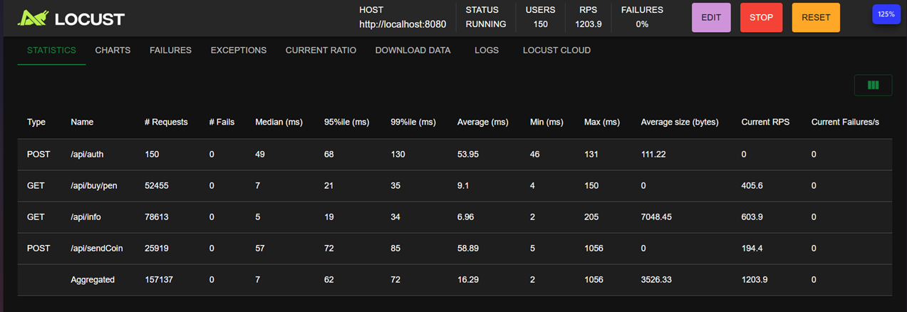

# AvitoTest

Сервис написан на **Go**.
В качестве субд использовал **PostgreSQL**

#### Использованные библиотеки
- [Chi](https://pkg.go.dev/github.com/go-chi/chi/v5) для роутинга в приложении.
- [CleanEnv](https://pkg.go.dev/github.com/ilyakaznacheev/cleanenv) с [godotenv](https://pkg.go.dev/github.com/joho/godotenv@v1.5.1#section-readme) для загрузки переменных окружения
- [Zap](https://pkg.go.dev/go.uber.org/zap) для логгирования 
- [bcrypt](https://pkg.go.dev/golang.org/x/crypto/bcrypt#pkg-functions) для хэширования и валидирования пароля
- [jwt](https://pkg.go.dev/github.com/golang-jwt/jwt/v5) для создания и проверки JWT токена

Линтер описан в [файле в корне проекта](/.golangci.yaml)
## Запуск приложения
`docker-compose up` при активном докере должен поднять контейнер и Postgres для него

По дефолту работает на порту 8080.
Эндпоинты работают согласно спецификации [openapi](/schema.yaml)(та, что прилагалась к заданию)
## Тестирование
Интеграционные тесты описаны в [файле](/internal/app/app_test.go)
Для них и для юнит-тестов слоя репозиториев поднимается docker контейнер с PostgreSQL

Для юнит-тестов слоя сервисов написал [моки](/test/mock)

### Нагрузочное тестированиее
Нагрузочное тестирование проводил с помощью locust. У меня на системе держалось ~1200 RPS со средним временем ответа 16,3мс
Ниже прикладываю скриншот, который получил во время тестирования

На всякий случай скрипт, который использовал для тестирования, добавил в репозиторий:
[test.py](/test/test.py)
